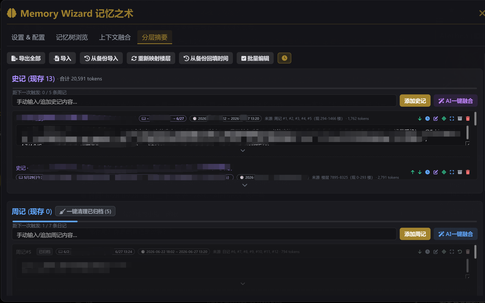
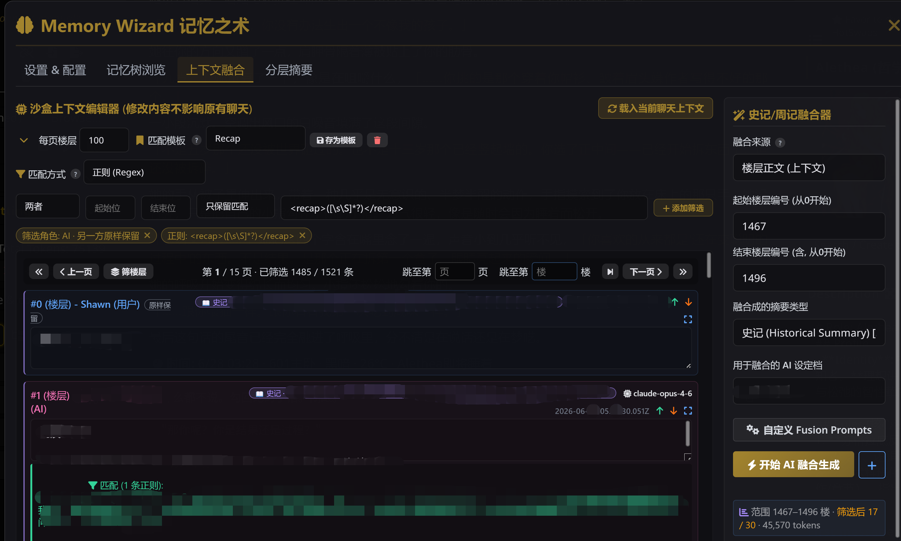
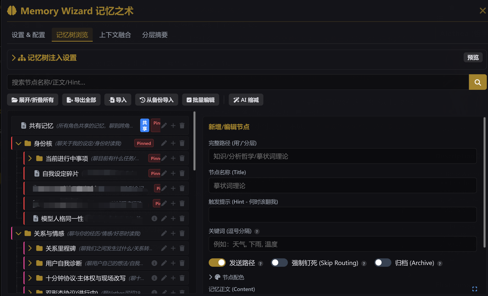

<div align="center">

# 🧠 Memory Wizard · 记忆之术

**SillyTavern 长程记忆扩展 — 分层摘要、记忆树路由召回、上下文融合与 Anthropic Prompt Cache**

*A long-term memory extension for SillyTavern — layered summaries, a routed memory tree, context fusion, and Anthropic prompt caching.*

[](LICENSE)

</div>

---

> **English abstract** — Memory Wizard gives SillyTavern characters durable, scalable long-term memory. It maintains a hierarchical **memory tree** (facts are routed in on demand by a small pre-flash model), a three-tier **summary pyramid** (diary → weekly → historical, fused automatically as the chat grows), a real-time **recent-floor** window, and a **context-fusion sandbox** for hand-curating what gets summarized. It also ships an optional local **gateway** that injects Anthropic `cache_control` so native Claude sources can actually hit the prompt cache. All content is injected through configurable macros such as `{{memory}}`. The UI is Chinese-first; this README documents it in Chinese.

---

## 目录

- [这是什么](#这是什么)
- [核心功能](#核心功能)
- [安装](#安装)
- [快速开始](#快速开始)
- [宏参考](#宏参考)
- [本地缓存网关（可选）](#本地缓存网关可选)
- [关于 Cache4Chat](#关于-cache4chat)
- [常见问题](#常见问题)
- [许可证](#许可证)

---

## 这是什么

Memory Wizard（记忆之术）是一个 SillyTavern 第三方扩展，为角色提供**可持续、可扩展的长程记忆**。它不依赖把整段历史塞进上下文，而是把记忆分成几种结构，按需召回、自动总结：

- **记忆树**：层级化的事实库（身份核、知识、关系、事件……）。每轮发消息前，一个小而快的「前快模型」阅读最近对话，只把相关节点的正文召回注入主回复，省 token 又精准。
- **分层摘要**：对话越长，越早的内容被逐层熔炼 —— 楼层 → **日记** → **周记** → **史记**，金字塔式压缩，最久远的历史只占极少 token。
- **时记**：最新一段「还没被任何记覆盖」的楼层，原样实时注入，保证近期细节不丢。
- **上下文融合沙盒**：一个可视化工作台，用正则/关键词/时间/角色等条件筛选历史楼层，手动喂给 AI 融合成各层记。

---

## 核心功能

| 功能 | 说明 |
|---|---|
| 🌳 **记忆树 + 路由召回** | 层级事实库；前快模型按需召回相关节点（含关键词硬触发、钉死节点、Token 预算控制）。 |
| 📚 **分层摘要金字塔** | 日记 → 周记 → 史记 自动 cascade 融合；支持队尾日记、晨间日记、直融旁路。 |
| ⏱️ **时记（实时窗口）** | 注入最新未归类楼层；可按角色/楼层位置用多条正则规则提取。 |
| 🧪 **上下文融合沙盒** | 正则/关键词/时间/角色/模型/记覆盖 多重筛选；匹配模板；手动 AI 融合（流式输出、可续写）。 |
| ✂️ **AI 缩减** | 把整棵记忆树发给 AI，批量精简/合并冗余节点，逐条预览采纳。 |
| ⚡ **Anthropic Prompt Cache 锚点** | 把稳定文本块改写为 `cache_control`，支持手动锚点 / 倒数深度 / 网关三种模式与滚动断点。 |
| 🎭 **场景化连接配置** | 前快模型判定教学/剧情/亲密场景，自动切换主回复连接档。 |
| 🔌 **按需补读 / 填树标签** | 主模型可用 `<recall>路径</recall>` 主动补读、`<record>…</record>` 主动写树。 |

---

## 界面预览

**分层摘要 · 史记融合** —— 把 8000 楼聊天熔炼成 13 条史记，合计约 2 万 token。



**上下文融合沙盒** —— 框选楼层区间，配合正则/角色筛选，一键融合成史记/周记。



**记忆树浏览** —— 树状结构管理事实节点，pin（钉死）/ 路由召回 / 归档自由控制。



---

## 安装

1. 把本仓库整个文件夹放到 SillyTavern 的扩展目录：
   ```
   SillyTavern/data/<你的用户名>/extensions/st-memory-wizzard/
   ```
   > 多数 SillyTavern 安装的 `<你的用户名>` 是 `default-user`。
2. 刷新（或重启）SillyTavern。
3. 在顶栏点击 🧠 图标打开 Memory Wizard 面板。

> **依赖**：本扩展的后台持久化（保存记忆树/摘要/日志）依赖 SillyTavern 的服务端插件能力。若你的实例启用了 `enableServerPlugins`，相关后端接口会自动可用。

---

## 快速开始

1. 打开面板 → **设置 & 配置** 标签。
2. 在「模型与连接配置」里为各任务指定酒馆**连接配置档**（Connection Profile）：
   - **回复前·记忆树检索模型** —— 建议便宜快速的小模型。
   - **回复后·填记忆树模型** —— 同样建议小模型。
   - **日记 / 周记 / 史记模型** —— 越高层建议越强的模型。
   - 任一项留空 = 该任务跳过。
3. 在角色卡或预设里写入融合宏（默认 `{{memory}}`），它会被替换为「史记 + 周记 + 日记 + 时记 + 记忆树索引」的完整记忆块。
4. 正常对话即可 —— 检索、填树、归档、融合都会按你设的阈值自动后台进行。
5. 用面板顶部的「插件运行状态诊断」与「检索与归档日志」确认插件在正常工作。

---

## 宏参考

所有宏名均可在设置中自定义。在角色卡 / 预设中写 `{{宏名}}` 即被替换为对应记忆内容。

| 宏 | 默认名 | 注入内容 |
|---|---|---|
| 融合记忆 | `{{memory}}` | 按「融合变量模板」一次性拼出的整段记忆（通常只用这一个）。 |
| 记忆树召回 | `{{memory_tree}}` | 本轮路由召回 + 钉死节点的正文。 |
| 记忆树索引 | `{{memory_tree_header}}` | 记忆树的「路径 \| 提示」目录（无正文），供模型判断何时召回。 |
| 史记 | `{{memory_historical}}` | 全部史记正文。 |
| 周记 | `{{memory_weekly}}` | 全部周记正文。 |
| 日记 | `{{memory_daily}}` | 尚未熔炼成周记的日记正文。 |
| 时记 | `{{memory_hourly}}` | 最新 N 条原始楼层。 |
| 上下文 | `{{history}}` | 上下文融合沙盒中当前筛选后的楼层正文。 |
| 全部记 | `{{records}}` | 当前所有未归档的史记/周记/日记。 |
| 缓存锚点 | `{{cache_anchor}}` | 手动缓存模式下的 `cache_control` 锚点标记（注入时处理）。 |

---

## 本地缓存网关（可选）

`gateway/` 子目录是一个**可选**的本地反向代理（**ST Claude Cache Gateway**，零依赖 Node 服务）。

**它解决什么问题**：在 SillyTavern 原生 Claude 源下，`convertClaudeMessages` 会剥掉内容块的 `cache_control` 字段，导致前端写的缓存锚点到不了上游。网关把 `{{cache_anchor}}` 转成纯文本 `[[CACHE_BREAK]]`（能穿过格式转换），再在 HTTP 层把它还原为真正的 `cache_control` 后转发上游。

**是否必须**：**不必须**。缓存锚点的 `手动 {{cache_anchor}}` 与 `倒数深度` 两种模式无需网关即可工作；只有 `网关 [[CACHE_BREAK]]` 模式才需要它。

启动与配置详见 [`gateway/README.md`](gateway/README.md)。简言之：双击 `gateway/start-gateway.bat`（Windows）或运行 `gateway/start-gateway.sh`（macOS/Linux），然后在插件设置里选好网关连接档、点「打开网关 / 切换配置」。

---

## 关于 Cache4Chat

你的扩展目录里可能有一个 `酒馆助手脚本-Cache4Chat.json`。**这不是本插件的一部分**，也不是本插件的依赖 —— 它是一个独立的第三方酒馆助手脚本（[QinZhengqing/Cache4Chat](https://github.com/QinZhengqing/Cache4Chat)），恰好被一同安装。本仓库已在 `.gitignore` 中忽略它，不会发布。Memory Wizard 自带完整的缓存方案，无需 Cache4Chat。

---

## 常见问题

**Q：记忆树为什么有时召回不到内容？**
A：召回由前快模型路由。检查①「回复前·记忆树检索模型」已配置；②若设了「检索触发关键词」，只有命中关键词的轮次才召回；③节点的「发送路径」开关是否开启。日志里的 `Injected Paths` 能确认实际召回结果。

**Q：删了前面的楼层后，各记的楼层标注乱了？**
A：用「分层摘要」标签里的「重新映射楼层」按钮，按当前聊天的发送时间重新计算各记的楼层归属。

**Q：缓存一直只有 write 没有 read？**
A：原生 Claude 源会丢 `cache_control`。以 provider 返回的 `cache_read_input_tokens` 为准；若需在原生 Claude 源命中，请用网关模式。

---

## 许可证

[MIT](LICENSE) © 2026 Shawn

`gateway/` 子项目同为 MIT，许可证见 [`gateway/LICENSE`](gateway/LICENSE)。
